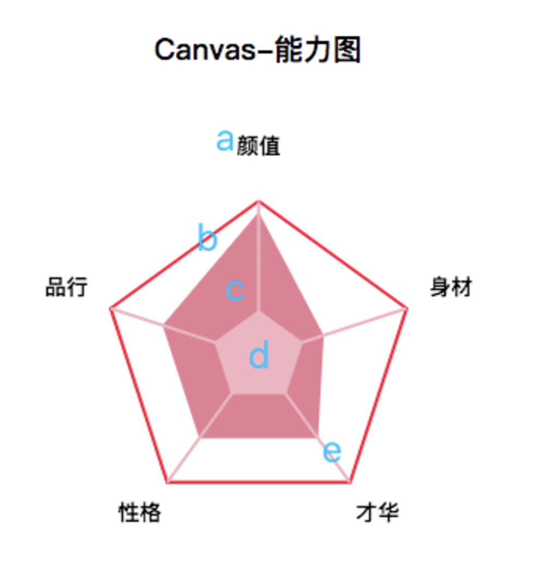

# 基于canvas的react能力图组建

    git clone git@github.com:fechengxiaocheng/canvas-ability-diagram.git
    npm install
    npm start

## 组建目录

``-src/components/Libility.js``

## 使用方法

    // 在业务代码中引入

    import Libility from './components/Libility';
    <Libility value={[['颜值', 0.9], ['身材', 0.2], ['才华', 0.5], ['性格', 0.5], ['品行', 0.5], ['才艺', 0.5]]}/>

## 效果图

## 主要功能点

  * 任意多边形展示自适应
  * 移动端自适应
  

## 后续可优化

  * 可配置icon
  * 颜色可配
  * 能力值多边形动画效果呈现
  

## 开发思路

  1、要实现如上图所谓的能力图，从外到内看无非就是以下5个部分组成。

   

    a.最外层的text能力属性

    b.外层正n边形

    c.中间不规则n边形

    d.内层正n边形

    e.由中心向外层发散的n条线

  2、剖析完1之后，可以了解到其核心就是画canvas多边形。

  关于怎么画多边形，网上有很多答案了。。我这边说下核心思路：

    const ability = this.canvasDom.getContext('2d');
    ability.beginPath();
    for (let i = 0; i <= number; i++) {
        const newX = Math.cos(i * Math.PI * 2 / number - Math.PI / 2) * r * abilityValue[i] + xCenter;
        const newY = Math.sin(i * Math.PI * 2 / number - Math.PI / 2) * r * abilityValue[i] + yCenter;
        ability.lineTo( newX, newY );
    }
    ability.strokeStyle = strokeStyle;
    ability.lineWidth = 2;
    ability.stroke();
    ability.closePath();

  1).在canvas画布上面，定义好多边形中心点坐标(xCenter, yCenter)，多边形半径r。

  2).循环n+1次，每次lineTo新的坐标(newX, newY)。

  3). newX' = Math.cos(i * Math.PI * 2 / number)，此i=0位的坐标是(cos0, sin0), 即每个多边形的最右边的点，此时如果是奇数多边形(3,5,7...)，就不是摆正的状态(如图歪的)。而要绘制的能力多边形，始终最靠上的点是正中位置(如图正的)。因此要逆时针旋转90度：newX'' = Math.cos(i * Math.PI * 2 / number - Math.PI / 2)。newY同理。后面乘以半径r。乘以abilityValue[i]如果都是1，则正多边形，小数则是不规则多边形。后面+xCenter，+yCcenter,则可以理解整个多边形以中心坐标为向量平移。

   

  4). 最后给多边形画边stroke或者填充fill。

3、绘制中间不规则n边形绘制的时侯需要注意，是以内层正n边形为参照画的，占据了一定空间的，而非(xCenter, yCenter)为参照。假设内层正多边形半径/外层正多边形半径 占比为innerSpace=0.2, , 则实际能力值=(1-0.2)*能力值 + 0.2, 所以传入的能力值arr为[...new Map(value).values()].map(i => ((1-innerSpace)*i + innerSpace))

